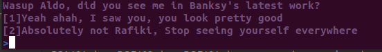
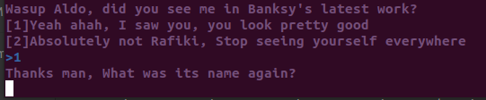
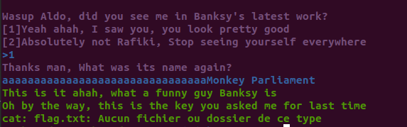

# Banksy

Difficulté : 600 pts

Date : 11-03-2023

#### Enoncé :

> You went to see the last Banksy exhibition, help Rafiki to remember in which work he appears

#### Fichier : [banksy](banksy)

## Découverte

On commence souvent par executer le fichier pour voir comment il fonctionne, pour voir les similarités dans le code après

Lorsqu'on lance le fichier on nous laisse un choix entre 2 options :


si on choisis, 1



on nous demande notre nom, ok, allons faire un tour dans gidra,

le code du main :
```c
undefined8 
main(void) { 
	int iVar1; 
	int local_4c; 
	char local_48 [32]; 
	undefined8 local_28; 
	undefined8 local_20; 
	undefined4 local_18; 
	local_28 = 0x616552206e697247; 
	local_20 = 0x726570; 
	local_18 = 0; 
	
	puts("un affichage"); 
	
	printf("%s%sWasup Aldo, did you see me in Banksy\'s latest work?\n[1]Yeah ahah, I saw you, you loo k pretty good\n[2]Absolutely not Rafiki, Stop seeing yourself everywhere\n%s%s>" ,&Purple,&Bold,&Blue,&Bold); 
	iVar1 = __isoc99_scanf(&DAT_004978ae,&local_4c); 
	
	if (iVar1 == 1) { 
		do { 
			iVar1 = getchar(); 
		}  while (iVar1 != 10); 
		
		if (local_4c == 2) { 
			printf("%s%sPfff, Laught now, but one day I\'ll be in cahrge\n",&Red,&Bold);
			exit(1); 
		} 
		printf("%s%sThanks man, What was its name again?\n%s%s",&Purple,&Bold,&Blue,&Bold); 
		fgets(local_48,0x37,(FILE *)stdin); 
		iVar1 = strncmp("Monkey Parliament",(char *)&local_28,0x11); 
		if (iVar1 == 0) { 
			printf("%s%sThis is it ahah, what a funny guy Banksy is\nOh by the way, this is the key you as ked me for last time\n%s" ,&Green,&Bold,&Reset); 
			system("cat flag.txt"); 
		} else { 
			printf("%s%sHmmm, %s, I don\'t think so, see you later Aldo\n%s",&Red,&Bold,&local_28,&Reset) ; 
		} 
	} 
	return 0; 
}
```

on peut donc avec notre analyse au préalable déterminer plus facilement quelle code sert à quoi, 
par exemple :

```c
printf("%s%sWasup Aldo, did you see me in Banksy\'s latest work?\n[1]Yeah ahah, I saw you, you loo k pretty good\n[2]Absolutely not Rafiki, Stop seeing yourself everywhere\n%s%s>" ,&Purple,&Bold,&Blue,&Bold); 
iVar1 = __isoc99_scanf(&DAT_004978ae,&local_4c); 
```
Notre demande du début est stocké dans *local_4c*

et donc si on met 2 dans *local_4c* on se retrouve ici :
```c
if (local_4c == 2) { 
	printf("%s%sPfff, Laught now, but one day I\'ll be in cahrge\n",&Red,&Bold);
	exit(1); 
} 
```

ensuite viens la demande du nom

```c
printf("%s%sThanks man, What was its name again?\n%s%s",&Purple,&Bold,&Blue,&Bold); 
fgets(local_48,0x37,(FILE *)stdin); 
```
0x37 = 55

on peut écrire 55 charactères dans la varibale *local_48*

ensuite viens le plus intéréssant, la comparaison du nom :
```c
iVar1 = strncmp("Monkey Parliament",(char *)&local_28,0x11); // 0x11 = 17
```

mais, on ne peut jamais écrire dans local_28 ???

## Résolution

Et bien si !!!!
souvenez vous, on peut écrire 55 charactères dans local_48, mais local_48 fait elle vraiment une taille de 55 charactères ?

```c
char local_48 [32]; // Et bien non !!!!
```

donc si on remplit local_48 avec 32 charactères, et biens les charactères suivant iront dans la variable juste après, et...

```c
char local_48 [32]; 
undefined8 local_28; 
```

bingo, la variable juste après c'est *local_28*

donc avec le payload : `aaaaaaaaaaaaaaaaaaaaaaaaaaaaaaaaMonkey Parliament`

où local_48 = "aaaaaaaaaaaaaaaaaaaaaaaaaaaaaaaa" et local_28 = "Monkey Parliament"



Bon là j'ai du le faire en local car les serveurs sont down, mais le cat flag.txt a bien fonctionné
`

#### Flag : `ZITF{}`

Mes DM sont toujours ouvert pour toutes questions !!!!!!!!!

LighTender#8830


