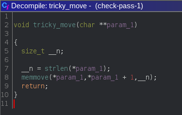

# Check Pass

Difficulté : 200pts
Date : 11-03-2023

#### Enoncé :

> Your mission is to enter on a controlled site. Will you succeed?

#### Fichier : [check-pass-1](check-pass-1)

## Découverte

Du reverse !!!!!!!!
Je suis loin d'être un champion dans cette catégorie, mais j'adore les trucs biens compliqués x)

Nous sommes sur un fichier ELF comme nous pouvons le voir
Je me munie de mon logiciel que je connais le mieux ghidra (pour le dl : [ici](https://github.com/NationalSecurityAgency/ghidra/releases))

Arrivé sur ghidra je check les strings (on sais jamais si le flag est en claire), mais rien, je me hâte alors à trouver la fonction main, par chance les fonctions ne sont pas obfusqués je l'identifie donc aisément et, voici à quoi elle ressemble :


et oui ghidra à un décompileur intégré héhé, c'est très pratique au début, mais bon c'est pas tout le temps sufisant
par ce que oui, le code est déjà beaucoup moins facile à lire, mais on va y aller pas à pas, mon objectif, est d'enseignier au plus débutant comment faire, comment comprendre le code décompilé

Déjà ligne 11, on vois la fonction [fgets](https://koor.fr/C/cstdio/fgets.wp), donc il y a récupération d'une chaine de caractère rentrer par l'utilisateur (notre mot de passe)
Cette fonction renvois une chaine de charactère vide en cas d'erreur, donc le if sur la variable *pcVar2* ne nous posera pas de problème

Donc ici on a (Ligne 13):
- *pcVar2* != ""
- *local_38* = notre mot de passe


---
TIPS : click droit sur la variable et vous pourez la renommé, cel va donc renommé tout les variables concerné, ça rend le code beaucoup plus lisible, de même, click droit sur un chiffre en hexa et vous pourrez le transformé en décimal facilement

---

ensuite viens un sscanf (pour mieux comprendre sscanf : [ici](https://www.tutorialspoint.com/c_standard_library/c_function_sscanf.htm)) qui met notre variable *local_38* dans *local_58*, si c'est réussi, vous vous en douter, iVar1 vaudra 1

ensuite ligne 16, *local_60* = *local_58* qui je le rapelle est égal à notre mot de passe

Donc ici on a (Ligne 16):
- *pcVar2* != ""
- *iVar1* = 1
- *local_60* = *local_58* = *local_38* = notre mot de passe

Maintenant on apelle la fonction `tricky_move` avec comme argument le pointeur de notre mot de passe, regardons ce qu'il y a dedans



okay, on vois une fonction qui s'appelle **memmove**, ça semble bouger des éléments dans un tableau, je vous propose de prendre connaissance aussi de la fonction **check_pass**, pour savoir comment notre fameux mot de passe est accepté


Ici, **check_pass**, utilise aussi notre mot de passe modifier préalablement par **tricky_move**,
on vois à la ligne 7 la fonction **strncmp**, qui d'où sont nom compare 2 chaines de charactères, on vois que param_1 (qui est notre mot de passe modifier par **check_pass**) doit être égale à `4_The_Monkey_heap_heap_heap_00ra`, on imagine que sans la fonction **check_pass**, il suffirai juste d'écrire `4_The_Monkey_heap_heap_heap_00ra` comme mot de passe, et ça passera !!!

## Résolution

Bon, le meilleur moyen de comprendre comment un bout de code marche, reste par tester avec un cas réel, test-on d'utiliser tout s'implement la string qui permetterais de validé le chall sans la fonction **tricky_pass**

Donc en parcourant le main on arriverais à la ligne 17 sans encombre avec *local_60* = `4_The_Monkey_heap_heap_heap_00ra`


maintenant analyson cette fonction **memmove**, rien de mieux que internet ! 
https://www.tutorialspoint.com/c_standard_library/c_function_memmove.htm

donc elle déplacerait la valeur de droite vers la valeur de gauche, hors ici, il ne faut pas oublier qu'on manipule des strings, donc des tableau, *\*param_1* est l'adresse de la première valeur de la string, donc si *\*param_1* = "Bonjour", alors *\*param_1* + 1 = 'onjour?'

Donc, si on fait 
```c
pass[] = "Bonjour";
tricky_move(pass);
for(int i = 0; i<7; i++){printf('%c',pass[i])} >>> "onjour?"
```

On obtient pass => onjour?
Tout à était déplacer de 1 vers la gauche

En ajoutant un charactère random devant Bonjour à la fin sur les 7 charactères qu'on regarde précisément, nous auront à la fin la chaine Bonjour

```c
pass[] = "aBonjour"; // On ajoute un charaxctère random devant la chaine
tricky_move(pass);
for(int i = 0; i<7; i++){printf('%c',pass[i])} >>> "Bonjour"
```

Okay, essayon avec le payload : `a4_The_Monkey_heap_heap_heap_00ra`


bingo le flag !


#### Flag : `ZiTF{3oihas7re2fw97orqcxmvq1qmu2l4lw4}`

Mes DM sont toujours ouvert !!!!!!!!!
LighTender#8830


